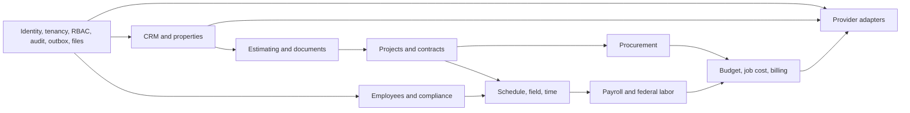
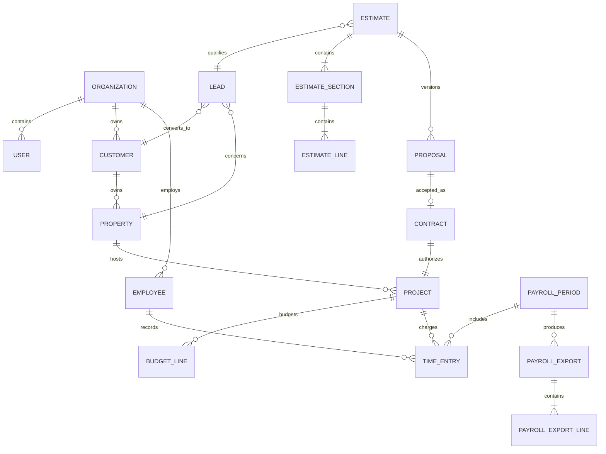

# System architecture

## Architecture decision

Benson Construction ERP is a modular monolith with strict module boundaries. FastAPI exposes `/api/v1`; React consumes the generated OpenAPI client; PostgreSQL 16 is authoritative; Redis supports cache, rate limits, and durable-worker coordination; object storage is accessed through one S3-compatible interface. Module extraction into services is deferred until measured scaling or isolation needs justify it.

The platform uses UUID primary keys, UTC timestamps, `numeric` money columns (never floats), explicit currency, optimistic `version` columns, immutable financial artifacts, soft deletion only where retention rules permit it, and append-only corrections for certified or posted records.

## Module dependency map

Imports point inward to platform contracts and never between peer modules' persistence layers. Cross-module work uses public services inside a database transaction and publishes domain events through the transactional outbox.

## Repository structure

`apps/api/app/core` owns platform primitives; `apps/api/app/modules/<module>` follows manifest, model, schema, repository, service, routes, permission, event, handler, audit, and test conventions. `apps/web/src/modules` mirrors business ownership. Generated OpenAPI code lives in `shared/generated`. Infrastructure, runbooks, architecture decisions, and user documentation are separately versioned.

## Canonical entity relationships

Every tenant-owned entity includes `tenant_id`, UUID `id`, creation/update attribution, timestamps, and `version`. Database foreign keys include tenant identity where practical; unique constraints are tenant-scoped. The full catalog is introduced module-by-module so no table exists without ownership and invariants.

## Authentication

Browser sessions use secure, HttpOnly, SameSite cookies with rotating server-side refresh sessions, CSRF tokens on state changes, device and login history, revocation, and step-up MFA. Passwords use Argon2id. Google OIDC and Firebase federation map verified external identities to an existing tenant membership; they never implicitly create privileged users. Passkeys are a later WebAuthn adapter. Password reset and employee activation tokens are random, single-use, hashed at rest, short-lived, and enumeration-safe.

## Tenant isolation

Tenant context is derived from the authenticated membership, never accepted from request payloads. Repositories require a `TenantContext`; SQLAlchemy query helpers always predicate `tenant_id`; PostgreSQL row-level security is defense in depth. Background jobs, storage keys, search indexes, AI retrieval, exports, webhooks, and integration links carry and verify tenant identity. Tests execute identical IDs across two tenants and attempt read, update, delete, export, search, and object access across the boundary.

## Permission model

| Capability | Owner/Admin | PM | Estimator | Field employee | Payroll | Client |
|---|---:|---:|---:|---:|---:|---:|
| Leads/customers/projects | Manage | Manage assigned | Read | Assigned read | Read limited | Own project read |
| Estimates internal cost/margin | Manage | By grant | Manage | No | No | No |
| Proposal client price | Manage | Manage | Manage | No | No | Own only |
| Own time enter/certify | Yes | Yes | Yes | Yes | Yes | No |
| Team time approve | By grant | Assigned team | No | No | Review only | No |
| Wage data/payroll export | By grant | No | No | Own statements | Manage | No |
| Integration administration | Manage | No | No | No | No | No |

Custom roles are permission sets plus project scope, financial-field masks, approval thresholds, and separation-of-duty constraints. Authorization is checked in services as well as routes to prevent BOLA.

## Events and workers

The committing transaction writes both domain state and `outbox_event`. A dispatcher leases records with `FOR UPDATE SKIP LOCKED`, publishes idempotently, and records attempts, next retry, last error, correlation ID, and dead-letter status. Handlers use inbox receipts keyed by event and handler. Financial approvals emit events only after all atomic database changes succeed. Workers handle documents, email, provisioning, sync, OCR, AI, indexing, expiry checks, reports, and webhook retries.

## Storage

An object-storage port supports local, MinIO, S3, and Cloud Storage. Keys are tenant-prefixed and unguessable. Metadata stores checksum, validated MIME and extension, size, visibility, project, version, scan state, and uploader. Upload is quarantined until validation and malware-scan hooks pass. Downloads use short-lived signed URLs after authorization; immutable signed documents use retention-aware versioning.

## API conventions

Resources live under `/api/v1`, use UUIDs, cursor pagination, allowlisted filters/sorts, RFC 9457 problem details, correlation IDs, rate-limit headers, and ETags derived from `version`. Mutations accept idempotency keys; updates require `If-Match`; commands name consequential transitions (`/estimates/{id}/approve`). Webhooks are signed, timestamped, replay-protected, retried, and observable. OpenAPI is the source for the strict TypeScript client.

## Frontend state and offline strategy

TanStack Query owns server state; React Hook Form and Zod own form state and client validation; URL state owns shareable filters; minimal context owns session, tenant, theme, and feature flags. IndexedDB stores explicitly supported offline records and a client-operation queue. Each operation has a UUID, base version, device timestamp, server receipt timestamp, sync state, and conflict result. Financial approvals, payroll locks, and contractual signatures remain online-only. Source files are capped at 350 nonblank/noncomment lines and components/functions at 150.

## Integration architecture

All external systems implement provider ports and persist `IntegrationLink`, encrypted credentials, scopes, sync cursor, idempotency key, version, status, and error. Google Directory provisioning is approval-triggered and saga-based: create unlicensed Cloud Identity user, set change-at-next-login, assign OU/groups/drives, send a separate single-use ERP activation link, then await confirmation. Gmail, Calendar, Drive, Docs, Sheets, Business Profile, Meta, Firebase, website, payroll, and accounting adapters cannot bypass domain permissions or audit.

## Payroll export architecture

Certified and approved time feeds a locked `PayrollPeriod`. A deterministic preview validates mappings, approvals, overtime, charge codes, wage determinations, duplicates, and federal exceptions with drill-down to source entries. Finalization snapshots immutable export lines, provider mapping versions, totals, format, checksum, and authorization. Provider adapters validate, build, optionally transmit, import results, and reconcile. Corrections create adjustment exports; original exports never change. Pay rate, actual cost, and bill rate are separately authorized facts.

## Federal timekeeping architecture

Charge codes model agency, contract, order, CLIN/funding, project, cost code, and labor category plus governed indirect codes. Daily entries retain direct, indirect, compensated, and uncompensated hours. Certification creates an immutable employee attestation; supervisors approve without impersonation. Corrections are linked adjusting entries with reason, recertification, and reapproval. Date-effective eligibility, licenses, labor categories, classifications, and wage determinations are validated at entry and again at payroll/invoice boundaries. Floor-check and labor-support reports are projections over the audit-preserving ledger.

## Deployment

Local development uses Compose with PostgreSQL, Redis, MinIO, API, worker, and web. The portable production shape is TLS proxy/load balancer to API/web, external PostgreSQL, S3-compatible storage, Redis, durable workers, secrets manager, metrics, traces, and centralized JSON logs. Google Cloud maps this to Cloud Run or GKE, Cloud SQL, Cloud Storage, Memorystore, Pub/Sub/Tasks, Secret Manager, Artifact Registry, Cloud Armor, Monitoring, and scheduled backups. Terraform modules will expose rather than hide these components.

## Security threat model

| Threat | Primary controls |
|---|---|
| Cross-tenant/BOLA access | Required tenant context, service authorization, RLS, adversarial tests |
| Credential/session theft | Argon2id, MFA, secure cookies, rotation, revocation, device history |
| Financial/payroll tampering | Separation of duties, optimistic locks, immutable snapshots, audit/outbox transactions |
| Malicious files/path traversal | Generated keys, MIME/extension/size checks, quarantine, scanning, signed URLs |
| Webhook/replay abuse | HMAC/OAuth verification, timestamps, nonce receipts, rate limits |
| SSRF and integration abuse | Egress allowlists, URL normalization, timeouts, scoped credentials |
| XSS/CSRF/injection | CSP, output encoding, CSRF tokens, parameterized SQL, schema validation |
| Prompt injection/data leakage | Tenant-filtered retrieval, source labeling, tool allowlists, no autonomous writes, human approval |
| Secret/default misconfiguration | Secret manager, startup fail-closed checks, CI production-config tests |
| Data loss/ransomware | PITR backups, object versioning, encrypted copies, restore drills |

## Testing strategy

Pytest covers domain rules, repositories, migrations, tenant isolation, permissions, financial math, federal time, payroll exports, and adapter contracts against PostgreSQL. Vitest and Testing Library cover accessible components and state; Playwright covers both vertical slices and portal boundaries. CI runs lint, typing, unit/integration/E2E suites, dependency and container scans, production-config checks, image build, migrations from empty and previous releases, backup/restore smoke tests, and blocks release on any critical failure.

## Material assumptions requiring review

This software records compliance evidence but does not determine legal compliance. State onboarding forms, prevailing-wage rules, certified-payroll formats, tax treatment, retention, e-signature validity, payroll-provider requirements, and federal contract clauses require counsel/accountant/contracting-officer review. Google and social APIs require customer-controlled projects, verification, scopes, and platform approval. Default money currency is configurable; Benson-specific phone, logo, licenses, rates, and legal names belong in tenant settings, not code.
