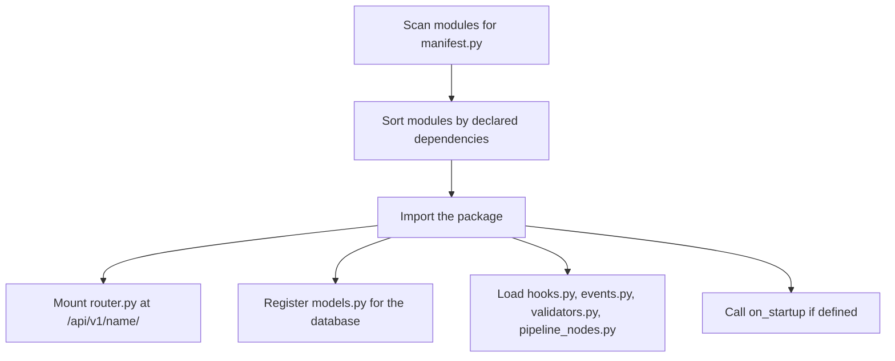
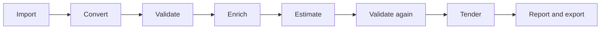

# Architecture overview

OpenConstructionERP is an open, modular platform for construction estimating and
construction management, published by DataDrivenConstruction under AGPL-3.0 with a
commercial option for enterprises. This page is the entry point to the architecture
docs. It explains how the codebase fits together: the monorepo layout, the module
system, the validation pipeline, the canonical data format, the data stores, and the
split between the backend and the frontend. This document tracks version 10.10.0.

## Design principles

A few ideas shape every part of the code:

- **Lightweight and simple.** One required dependency, PostgreSQL. The core runs on a
  small VPS or on a laptop.
- **Modules are plugins.** Every feature is a self-contained package that the loader
  discovers and mounts automatically. The platform ships 161 of them.
- **Validation is not optional.** Imported and edited data passes through a rule-based
  validation step that is part of the core workflow, not an afterthought.
- **CAD and BIM through conversion.** All drawing and model formats convert into one
  canonical JSON format through the DDC cad2data pipeline. We do not parse IFC natively
  and do not use IfcOpenShell.
- **Assisted, human-confirmed.** The platform suggests classifications, quantities, and
  cost matches with confidence scores. A person reviews and confirms before anything is
  applied. Nothing is auto-applied.
- **Open data standards.** GAEB XML, DIN 276, NRM, MasterFormat, IFC, and BCF are
  first-class.

## Technology at a glance

| Layer | What we use |
|-------|-------------|
| Backend API | Python 3.12 with FastAPI, Pydantic v2, async SQLAlchemy |
| Frontend | React 18 with TypeScript, built by Vite, styled with Tailwind |
| Frontend state | Zustand for global state, React Query for server state |
| Database | PostgreSQL only (embedded PostgreSQL 16 for local dev) |
| Vector search | Qdrant, or an embedded in-process store for local installs |
| File storage | Local filesystem, or any S3-compatible bucket such as MinIO |
| CAD and BIM | DDC cad2data pipeline into one canonical JSON format |
| Desktop | An optional desktop shell wraps the same backend and frontend |

## Monorepo layout

| Path | What lives here |
|------|-----------------|
| `backend/` | The FastAPI application: app factory, settings, the core framework, and all 161 business modules |
| `frontend/` | The React single-page application |
| `packages/oe-sdk/` | Python SDK for building modules outside the main tree |
| `modules/` | Community and example modules, including the module template |
| `data/` | Seed data: cost catalogs, classifications, templates, and rule packs |
| `desktop/` | Desktop shell and installer build |
| `deploy/` | Deployment configs (Docker, Railway, Render, Terraform) |
| `docs/` | Architecture notes, Architecture Decision Records, and RFCs |
| `scripts/`, `tools/` | Maintenance, build, and data helpers |

## Backend and frontend split

The **backend** is a FastAPI application under `backend/app/`. `main.py` is the app
factory: it configures logging and middleware, mounts a few system routes, and asks the
module loader to discover and mount every module. `config.py` holds typed settings,
`database.py` builds the async SQLAlchemy engine and session, and `dependencies.py`
wires request-scoped dependencies such as the current user and role checks. The request
pipeline (CORS, security headers, request correlation id, locale) lives in
`middleware/`. The reusable framework, the parts that are not tied to any one feature,
lives in `core/`: the module loader, the event bus, the hook registry, the validation
engine, the RBAC permission engine, storage, vector search, and i18n. Business features
live in `core/`'s sibling, `modules/`.

The **frontend** is a React single-page application under `frontend/src/`. `app/`
holds the shell, routing, layout, and i18n setup. `features/` holds roughly 150 feature
folders that mirror the backend modules. `shared/` holds the design-system UI
components, hooks, utilities, the generated API client, and auth helpers. `stores/`
holds the Zustand stores. `modules/` holds an in-app module registry so optional modules
register their routes, sidebar entries, and search from a single manifest. Heavy pages
(the BOQ grid, the 3D and BIM views, the takeoff viewer) are code-split and loaded on
demand.

## The module system

Each backend module is a folder under `backend/app/modules/<name>/` with a `manifest.py`
that defines a `ModuleManifest`: its name, version, display name, category, declared
dependencies, and whether it installs by default. On startup the loader does the same
thing for every module, by convention rather than configuration:

A module's router auto-mounts at `/api/v1/<module>/` (kebab-case is the canonical URL,
with the underscore form kept as a legacy alias). Its models auto-register so database
migrations pick them up. Its hooks, events, and validators load automatically if the
files exist. Core modules are always on. Modules in the other categories (integration,
regional, community) can be enabled or disabled at runtime, and the choice is persisted,
so a workspace only carries what it needs. The frontend mirrors this contract: a module
registry under `frontend/src/modules/` wires routes, sidebar, and search from a
per-module manifest, so adding a module is a matter of dropping in a folder.

## Events and hooks

Modules stay decoupled through two mechanisms in `core/`. The **event bus**
(`core/events.py`) is publish and subscribe with dot-notation names such as
`boq.position.created` or `cad.import.completed`. A module publishes an event and any
other module can subscribe to it, with no direct import between them. Handlers can be
sync or async, and a detached-publish variant lets a request commit before its
subscribers run. **Hooks** (`core/hooks.py`) come in two kinds: filters run data through
a priority-ordered chain and return the transformed value, while actions are
fire-and-forget side effects at a named point. Filters propagate errors because they are
part of the data path; actions log and swallow errors because they are side effects.

## Validation pipeline

Validation is a first-class citizen, not an add-on. The engine lives in
`core/validation/`. A `ValidationRule` declares an id, the standard it belongs to, a
severity (error, warning, or info), and a category (structure, completeness,
consistency, compliance, quality, or custom). Rules are grouped into named rule sets
such as `din276`, `gaeb`, `nrm`, `masterformat`, `boq_quality`, `bim_compliance`, and
`project_completeness`, plus regional sets. The engine runs the selected rule sets over
the data and returns a `ValidationReport` with an overall status, a severity-weighted
quality score from 0.0 to 1.0, and one result per checked element that links back to its
source, whether that is a BOQ position, a drawing area, or a cost item. The UI shows the
report as a traffic-light dashboard: green for passed, amber for warnings, red for
errors. A blocking error caps the score so a single fatal issue can never read as high
quality.

## The workflow

The validation step appears twice in the end-to-end flow, once on imported source data
and once on the finished estimate.

- **Import.** Upload a PDF, photo, or CAD file. The format is detected and routed.
- **Convert.** CAD and BIM go through DDC cad2data into the canonical format. PDFs go
  through vector extraction and OCR, photos through computer vision.
- **Validate.** Structure, classification, completeness, and consistency checks produce
  a report the user resolves before moving on.
- **Enrich.** Suggested classifications and cost matches (via vector search over the
  cost database) arrive with confidence scores for a person to confirm.
- **Estimate.** The BOQ editor applies rates, assemblies, and what-if scenarios with
  live cost rollups.
- **Validate again.** BOQ quality rules, benchmark comparison, and coverage checks run
  over the estimate.
- **Tender and report.** Generate tender documents, compare bids, and export to GAEB
  XML, Excel, CSV, PDF, and JSON.

## Canonical data format and DDC cad2data

Every CAD and BIM source (DWG, DGN, RVT, IFC) is converted by the DDC cad2data pipeline
into one canonical JSON document. That document carries source metadata plus a flat list
of elements, where each element has its category, its classification (DIN 276,
MasterFormat, and so on), its geometry, its computed quantities, its properties, and its
spatial relations, alongside the project levels, zones, and spatial structure. PDFs and
photos are processed differently but land in the same shape. Because everything
downstream, validation, BOQ linking, and cost matching, reads this one format, IFC is
just another input to convert, not a runtime dependency. That is why the platform never
parses IFC natively and never uses IfcOpenShell. BCF is allowed as an input and output
format for issues and viewpoints, because it is XML over data with no such dependency.
The reasoning is recorded in [ADR-002](../adr/002-no-ifcopenshell-ddc-canonical-only.md).

## Data stores

PostgreSQL is the single required dependency. For local development and the desktop
build the app starts an embedded PostgreSQL 16, so there is no Docker and no separate
database to run; set `DATABASE_URL` to point at an external PostgreSQL for a server
deployment. SQLite support was removed in v6.6.0, so the code is PostgreSQL only.

Two optional stores add capability without becoming hard requirements:

- **Vector search** powers semantic cost matching and cross-module search. It runs on
  Qdrant by default, which is recommended for servers, or on an embedded in-process
  vector store for a zero-config local install. If no vector backend is reachable the
  platform still boots and only the semantic features are disabled.
- **File storage** for uploaded drawings, BIM geometry, takeoff PDFs, and generated
  reports goes through a storage abstraction. It writes to the local filesystem by
  default, or to any S3-compatible bucket such as MinIO, selected by the
  `STORAGE_BACKEND` setting.

## Where to go next

- **Architecture Decision Records** record the non-obvious choices and their
  consequences. Start with the [ADR index](../adr/README.md). The most load-bearing
  ones are the [snapshot storage model](../adr/001-snapshot-storage-model.md),
  [no IfcOpenShell, DDC canonical only](../adr/002-no-ifcopenshell-ddc-canonical-only.md),
  the [vector match service](../adr/003-vector-match-service.md), and the
  [partner-pack architecture](../adr/2026-05-28-partner-pack-architecture.md).
- **RFCs** capture the rationale behind larger feature designs. See the
  [RFC index](../rfc/README.md).
- **[Field worker mobile surface](./FIELD_WORKER_MOBILE_DESIGN.md)** is the design for
  the site-facing mobile surface: restricted access, thumb-zone layout, and offline
  tolerance.
